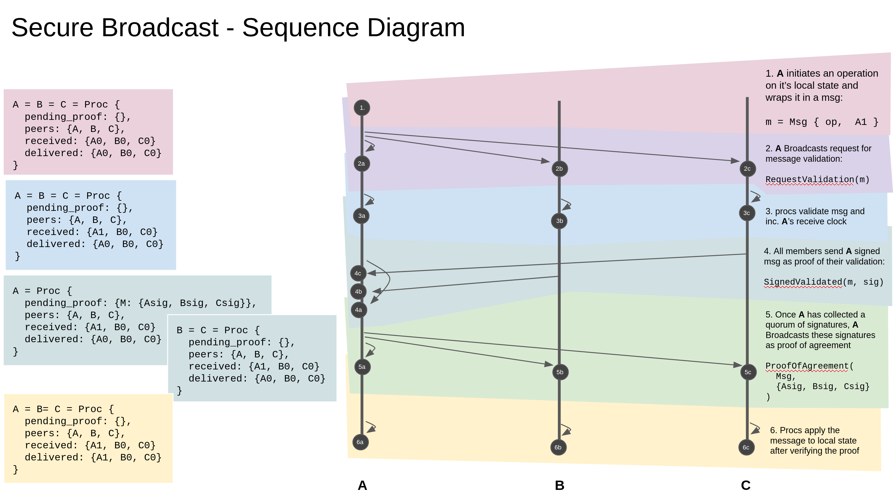

# Byzantine Fault Tolerant Eventually Consistent Algorithms

**This research was sponsored by [Maidsafe](https://maidsafe.net/) and released to the public at the request of Maidsafe. (Licensed under MIT/BSD-3)**

The repository contains a byzantine fault tolerant systems for achieving network agreement over eventually consistent algorithms.

The system is implemented as a three layered onion. The center is the eventually consistent algorithm, e.g. CRDT's or perhaps a causal asset transfer system (AT2). This core is responsible for validating and applying incoming operations, this is the "business logic" of the system.

On top of the core we layer an implementation of [SecureBroadcast](https://dahliamalkhi.files.wordpress.com/2016/08/wansecure-multicast-icdcs97.pdf). SecureBroadcast provides our "double spend" protection. It allows us to ensure that we will never have a conflicting operation accepted by the network.

At the outer most layer, we have our network implementation, that is, the layer that actually does the the dirty work of interacting with the real world. Sending, receiving packets, ensuring reliable packet delivery, etc.


## Running the Test nets

To run the test networks, we make use of [quickcheck](https://github.com/BurntSushi/quickcheck) for generating a large range of network behavior and ensuring our properties hold.

```bash
# install rust + cargo (see https://rustup.rs/)

QUICKCHECK_TESTS=1000 cargo test
```

## Repo Structure

```
bft-crdts/src/
├── bank                              # Specialization of the network to a distributed bank
│   ├── bft_bank_net.rs
│   ├── bft_bank.rs
│   └── mod.rs
├── orswot                            # Specialization of the network to an ORSWOT
│   ├── bft_orswot_net.rs
│   ├── bft_orswot.rs
│   └── mod.rs
├── actor.rs                          # the actor is the public identity of a process
├── deterministic_secure_broadcast.rs # implementation of Secure Broadcast
├── lib.rs
├── net.rs                            # The in-memory network layer implementation
├── traits.rs                         # The SecureBroadcastAlgorithm trait
└── at2_impl.r                        # An implementation of AT2 as described in the paper
```

## Onion Layers

### The Network Layer

The network layer implemented in this repository is a simulated, in-memory network with an assumption that packets are delivered reliably (no packet drops) and in any order (not necessarily the order they were produced).

In a production deployment, the network layer would need to be adapted to real world network constraints and all the complexity that entails.


### Secure Broadcast

Secure broadcast is similar in operation to a 2-phase-commit. It differs in that the underlying algorithm decides the level of parallelism. The only constraint directly imposed by secure broadcast is that operations produced by an actor is processed in the order that operations are created by the actor (source ordering). Below is a sequence diagram of the secure broadcast algorithm, process states as they evolve are on the left.



### Eventually Consistent Algorithm

At the core, we have the algorithm we are performing this byzantine fault tolerance over.

The contract the algorithm must fulfill is given by this trait here:

``` rust
pub trait SecureBroadcastAlgorithm: Clone + Debug + Eq {
    type Op: Debug + Clone + Hash + Eq + Serialize; // The set of ops this algorithm accepts
    type ReplicatedState: Clone + Debug + Eq;  // The snapshot state that is used to onboard new peers

    /// initialize a new replica of this algorithm
    fn new(actor: Actor) -> Self;

	/// Take a snapshot of this algorithms state
    fn state(&self) -> Self::ReplicatedState;

    /// Called when onboarding a new replica of this algorithm
    fn sync_from(&mut self, other: Self::ReplicatedState);

    /// Validate any incoming operations, here you must perform your byzantine fault
	/// tolerance checks specific to your algorithm
    fn validate(&self, from: &Actor, op: &Self::Op) -> bool;

    /// Execute an operation after the network has validated it
    fn apply(&mut self, op: Self::Op);
}
```

## References + Prior Art
[AT2: Asynchronous Trustworthy Transfers](https://arxiv.org/pdf/1812.10844.pdf)
[Secure Reliable Multicast Protocols in a WAN](https://dahliamalkhi.files.wordpress.com/2016/08/wansecure-multicast-icdcs97.pdf)
[Byzantine Fault Tolerance for Services with Commutative Operations](https://academic.csuohio.edu/zhao_w/papers/scc2014zhao.pdf)
[Concise Version Vectors in WinFS](https://dahliamalkhi.files.wordpress.com/2016/08/winfs-version-vectors-disc2005.pdf)
